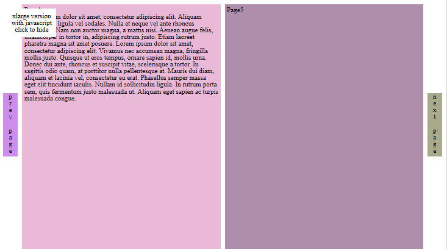

{{ website.cell('6','dlMetro','','') }}
#dlMetro
How to dress a web site with Windows 8 metro UI?
{{ website.endCell() }}

{{ website.cell('223663','dlMetro-examples','','/00_readme.html') }}
#Readme

The example generated following the readme on github
{{ website.endCell() }}

{{ website.cell('223663','dlMetro-examples','','/01_basic.html') }}
#Basic

Basic example, with different headers and footers
{{ website.endCell() }}

{{ website.cell('223663','dlMetro-examples','','/02_fixed_flow_header.html') }}
#Headers: fixed and flow

Use of fixed and flow header
{{ website.endCell() }}

{{ website.cell('223663','dlMetro-examples','','/03_custom_cell.html') }}
#Cell appearance

Modify cell appearance
{{ website.endCell() }}

{{ website.cell('223663','dlMetro-examples','','/04_fixed_footer.html') }}
#Footer

Use of fixed footer
{{ website.endCell() }}

{{ website.cell('223663','dlMetro-examples','','/05_invisible_things.html') }}
#Invisible things

Some cells appears only for certain visualizations
{{ website.endCell() }}

{{ website.cell('223663','dlMetro-examples','','/06_embed_maps.html') }}
#Add some maps

dlMetro and Openlayers 3
{{ website.endCell() }}

{{ website.cell('223663','dlMetro-examples','','/11_store.html') }}
#Online store

Show many items like an online store
{{ website.endCell() }}

{{ website.cell('223663','dlMetro-examples','','/12_book.html') }}
#A book

A book with one or two pages
{{ website.endCell() }}

{{ website.cell('223663','dlMetro-examples','','/13_share_always.html') }}
#Share this

"Share this" buttons always visible
{{ website.endCell() }}

