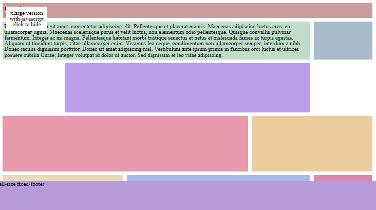
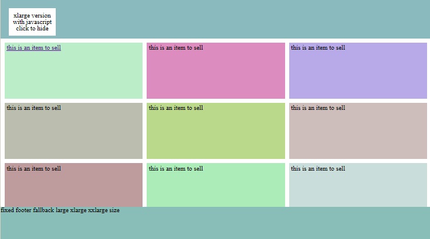
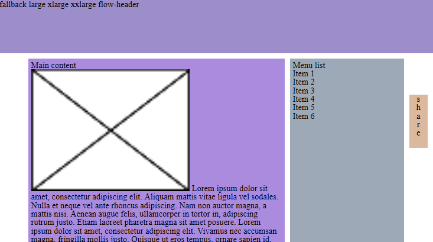

{{ website.cell('6','') }}
#dlMetro
How to dress a web site with Windows 8 metro UI?
{{ website.endCell() }}

{{ website.link('dlMetro-examples','/00_readme.html')}}
{{ website.cell('223663','') }}
#Readme

The example generated following the readme on github
{{ website.endCell() }}
{{ website.endLink() }}

{{ website.link('dlMetro-examples','/01_basic.html')}}
{{ website.cell('223663','') }}
#Basic

Basic example, with different headers and footers
{{ website.endCell() }}
{{ website.endLink() }}

{{ website.link('dlMetro-examples','/02_fixed_flow_header.html')}}
{{ website.cell('223663','') }}
#Headers: fixed and flow

Use of fixed and flow header
{{ website.endCell() }}
{{ website.endLink() }}

{{ website.link('dlMetro-examples','/03_custom_cell.html')}}
{{ website.cell('223663','') }}
#Cell appearance

Modify cell appearance
{{ website.endCell() }}
{{ website.endLink() }}

{{ website.link('dlMetro-examples','/04_fixed_footer.html')}}
{{ website.cell('223663','') }}
#Footer

Use of fixed footer
{{ website.endCell() }}
{{ website.endLink() }}

{{ website.link('dlMetro-examples','/05_invisible_things.html')}}
{{ website.cell('223663','') }}
#Invisible things

Some cells appears only for certain visualizations
{{ website.endCell() }}
{{ website.endLink() }}

{{ website.link('dlMetro-examples','/06_embed_maps.html')}}
{{ website.cell('223663','') }}
#Add some maps

dlMetro and Openlayers 3
{{ website.endCell() }}
{{ website.endLink() }}

{{ website.link('dlMetro-examples','/11_store.html')}}
{{ website.cell('223663','') }}
#Online store

Show many items like an online store
{{ website.endCell() }}
{{ website.endLink() }}

{{ website.link('dlMetro-examples','/12_book.html')}}
{{ website.cell('223663','') }}
#A book

A book with one or two pages
{{ website.endCell() }}
{{ website.endLink() }}

{{ website.link('dlMetro-examples','/13_share_always.html')}}
{{ website.cell('223663','last') }}
#Share this

"Share this" buttons always visible
{{ website.endCell() }}
{{ website.endLink() }}

