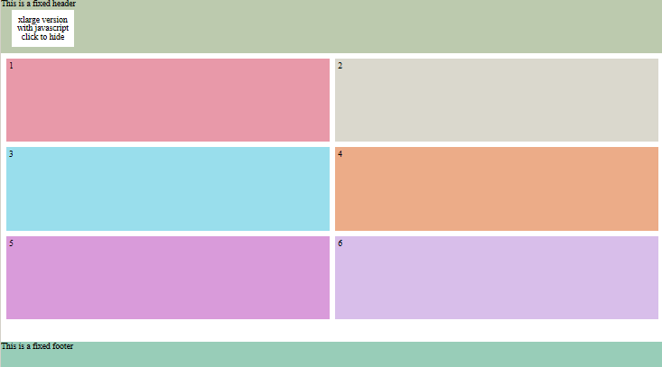
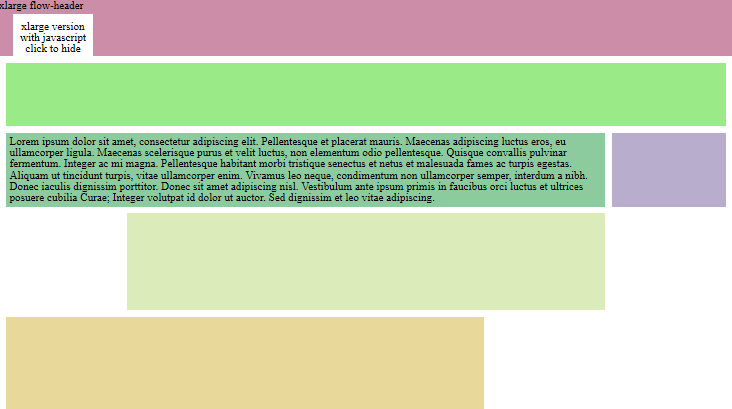
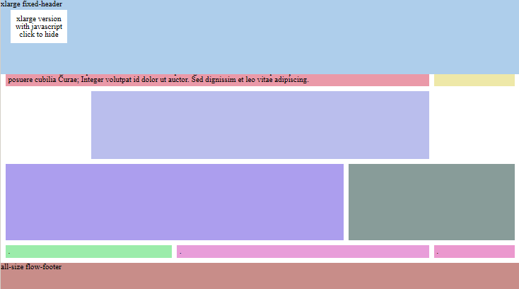
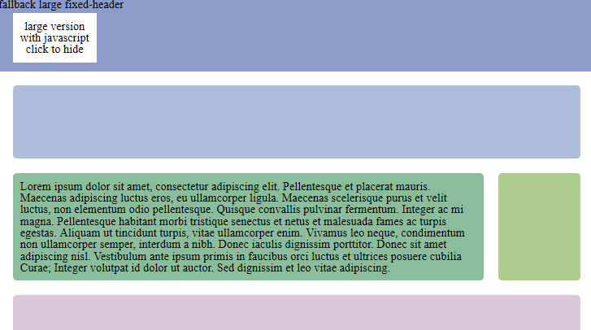
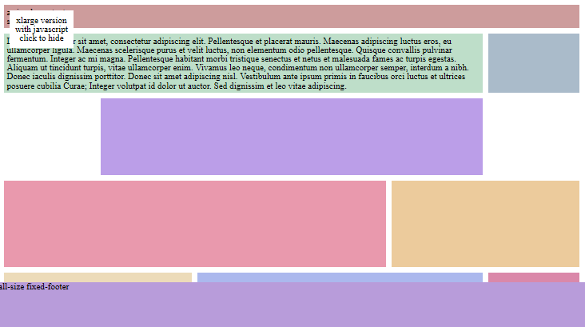

{{ website.link('visibility-program','')}}
{{ website.cell('6','') }}
#Visibility program: 

Retweet our tweets and follow us on twitter for accessing:

 - tython (full access, no demo)
 - surfway (credits to build webapps from an xml)

See more details here
{{ website.endCell() }}
{{ website.endLink() }}

{{ website.link('dlMetro','') }}
{{ website.cell('222662','') }}
#dlMetro
The goal of dlMetro is to dress a site with an interface like Windows 8 Metro UI.
Two files make the solution:

- **dlMetro.css:** which contains all the stylesheets needed
- **dlMetro.js:** which eliminates scrollbar and makes blocks same size

No external dependency is required.
{{ website.endCell() }}
{{ website.endLink() }}

{{ website.link('tython','') }}
{{ website.cell('222662','') }}
#tython

### A Template engine written in python.

- Makes you capable to use vanilla **python code in page** genaration and markdown formatting for the content.
- Usage is free but registration is needed. Yust put your (vaild) email into the registration form.

Now on git hub, download the zip and follow the readme to start.
                
{{ website.endCell() }}
{{ website.endLink() }}

{{ website.link('websu','') }}
{{ website.cell('222662','') }}
#websu
Manage easily the process of updating of your website.

- user password protection
- works under apache httpd through http/https
- capable to encode sensible files using blowfish cipher
- keeps historical versions
- minimize offline time by switching rewrite rules only at the end of an update
- support both static and dynamic web sites

{{ website.endCell() }}
{{ website.endLink() }}

{{ website.link('surfway','') }}
{{ website.cell('222662','') }}
#surfway

From a db to a complete web application passig from an XML.
Now on github

{{ website.endCell() }}
{{ website.endLink() }}

{{ website.cell('444664','') }}

<figure>
{{ website.link('dlMetro-examples','/00_readme.html')}}{{ website.endLink() }}
{{ website.link('dlMetro-examples','/01_basic.html')}}{{ website.endLink() }}
{{ website.link('dlMetro-examples','/02_fixed_flow_header.html')}}{{ website.endLink() }}
{{ website.link('dlMetro-examples','/03_custom_cell.html')}}{{ website.endLink() }}
{{ website.link('dlMetro-examples','/04_fixed_footer.html')}}{{ website.endLink() }}
</figure>

{{ website.endCell() }}

{{ website.cell('333663','') }}
#About
**develost.com** is one-man band.  
 
What is Open Space Technology?

- is the approach I use to design and build better useful software
- is an approach to purpose-driven leadership [more](http://en.wikipedia.org/wiki/Open_Space_Technology)
- is a simple way to run productive meetings  [more](http://openspaceworld.org/)

&nbsp;
{{ website.endCell() }}

{{ website.cell('333663','last',) }}
I use the software I realize:

- **dlMetro** for styling the website
- **websu** for updating the website
- **surfway** for some small projects
- **tython** as CMS

&nbsp;
{{ website.endCell() }}